# se-day-2-git-and-github

## Explain the fundamental concepts of version control and why GitHub is a popular tool for managing versions of code. How does version control help in maintaining project integrity?

Version control allows for tracking and managing changes to code.

_Repository_: A storage space where you can manage and version control your code and files, keeping track of changes over time.

_Commit_: process of submitting changes made to a code repository.

_Push_: Commiting/uploading local changes to a remote repository.

_Branching_: The practice of creating divergent paths in the source code repository to work on different features or fixes without disrupting the main codebase.

_Merge_: Integrating changes from one branch into another.

A _VCS_ helps in maintaining project integrity by keeping a comprehensive history of all changes made to the project, including who made the changes and why. This audit trail is invaluable for understanding the evolution of a project, debugging issues, and holding developers accountable for their changes. It provides a clear picture of the project’s progression and the decisions that shaped it.


## Describe the process of setting up a new repository on GitHub. What are the key steps involved, and what are some of the important decisions you need to make during this process?

1. Open your GitHub account

2. On the top of the page, click on repositories(see screenshot attached below)

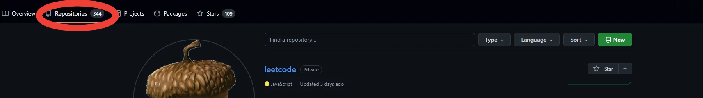

3. Select new
   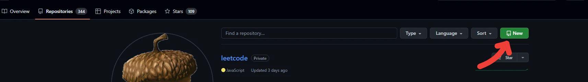

4. Enter the repository name, select whether you want the repository to be public or private. Add a readme file(optional) and select create repository.
   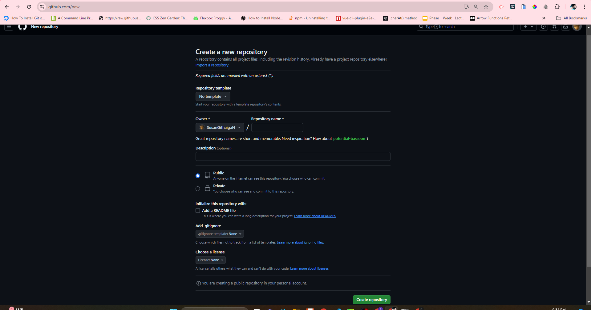

The most important decision you have to make during this process is deciding on the repository name and selecting the repositorie's privacy settings, whether you want it to be public or private.


## Discuss the importance of the README file in a GitHub repository. What should be included in a well-written README, and how does it contribute to effective collaboration?

<!-- A README is used to communicate important information about your project, outlining it's purpose and goals. -->

A README file is important because it helps new users understand the project and how to use it. It also helps in collaboration by providing a clear understanding of the project's goals and objectives. It also helps in reducing the time it takes for new users to get started with the project.

A well-written README should contain the following information:

_Project title_

_Project description_

_Project requirements, dependencies and the installation instructions_

_Project roadmap_

_Usage instructions_

_Contributing guidelines(if you want to open-source your project)_

_License information_

_Project contributors_


## Compare and contrast the differences between a public repository and a private repository on GitHub. What are the advantages and disadvantages of each, particularly in the context of collaborative projects?

| Criteria   | Private Repository                                     | Public repository                |
| ---------- | ------------------------------------------------------ | -------------------------------- |
| Visibility | Only visible to the repository owner                   | Visible to any GitHub user.      |
| Forking    | Cannot be forked unless one is added is a contributor. | Can be forked by any GitHub user |
| Use case   | Best for projects that require confidentiality         | Best for open source projects    |
| Security   | More secure as only the owner can access the repository| Less secure as anyone can acces the repository  |


## Detail the steps involved in making your first commit to a GitHub repository. What are commits, and how do they help in tracking changes and managing different versions of your project?

_Commit:_ A snapshot of your project's files at a specific point in time. It records changes made to your codebase, allowing you to track and manage different versions of your project.

Commits help in version control by keeping a history of changes, enabling you to revert to previous states, collaborate with others without conflict, and understand the evolution of the project over time

steps involved in making your first commit to a GitHub repository

1. Open your repository in your local machine

2. Make changes to your code

3. Open your terminal and navigate to your repository

4. Type `git add .` to stage all changes

5. Type `git commit -m "your commit message"` to commit your changes

6. Type `git push origin master` or `git push origin main`(depends on the name of the branch you are currently on) to push your changes to GitHub

7. Open your repository on GitHub to see your changes.


## How does branching work in Git, and why is it an important feature for collaborative development on GitHub? Discuss the process of creating, using, and merging branches in a typical workflow.

Branches allow you to develop features, fix bugs, or safely experiment with new ideas in a contained area of your repository.

_Creating branches_

1. Open your repository on GitHub

2. Click on the "New branch" button

3. From the file tree view on the left, select themain branch dropdown menu

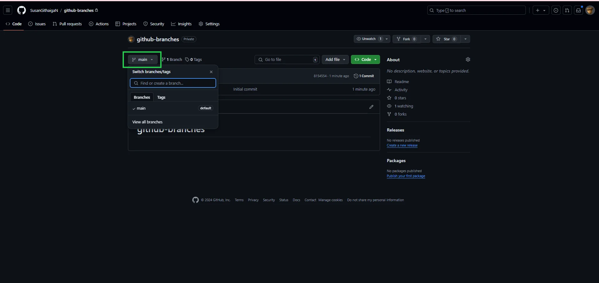

Alternatively, click on the branch button:

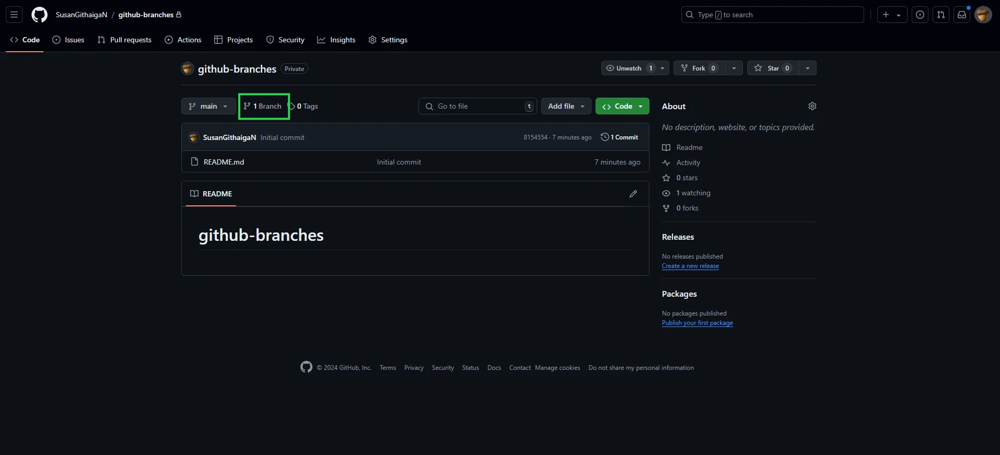

4. Click on **New branch**

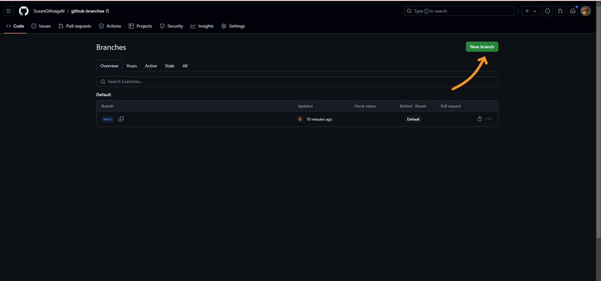

5. Under "Branch name", type a name for the branch.

6. Under "Branch source", choose a source for your branch.

If your repository is a fork, select the repository dropdown menu and click your fork or the upstream repository.
Select the branch dropdown menu and click a branch.

7. Click Create branch.

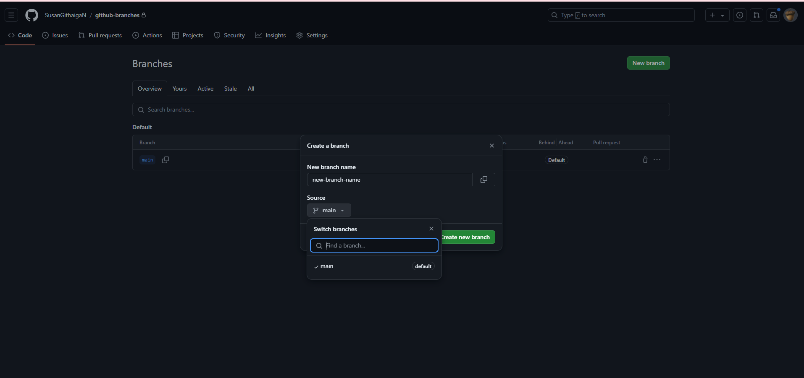


_Using branches_

1. List all branches in your repository

```sh
git branch
```

2. List all remote branches

```sh
git branch -a
```

3. Switch branches

```sh
git checkout ＜branchname＞
```

4. Create and check out `＜new-branch＞`. The `-b` option is a convenience flag that tells Git to run `git branch`  before running `git checkout ＜new-branch＞`

```sh
git checkout -b ＜new-branch＞
```

5. Create a new branch

```sh
git branch <branch-name>
```

6. Delete a branch

```sh
git branch -D <branch>
```


_Merging branches_

1. Confirm the receiving branch
Run `git status` to ensure that you are on the branch you want to merge, if not, run `git checkout branch-name` and switch to the branch you want to merge your changes to.

2. Fetch the latest remote commits to the repository by running `git fetch`

3. After fetching, make sure your branch has the most recent updates by running `git pull`


## Explore the role of pull requests in the GitHub workflow. How do they facilitate code review and collaboration, and what are the typical steps involved in creating and merging a pull request?

Pull requests provide a way for developers to notify their team members that they have completed a product feature/ made new changes. It also provides a forum for discussing the new feature, checking for conflicts & receiving feedback on the same.(see screenshot attached below)

_Steps to create & merge a pull request_

1. On your local branch, commit your changes & publish the local branch 

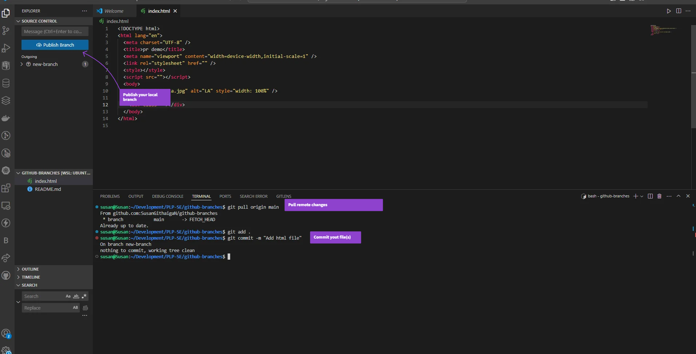

2. Open your reposiroty on github, and select `Compare & pull request`

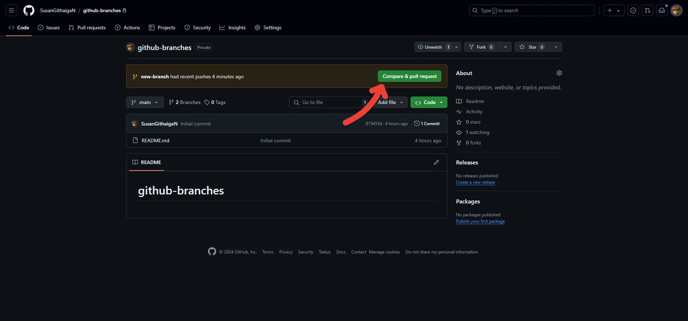


3. Add a title and descitpion for your pr, and select `create pull request`

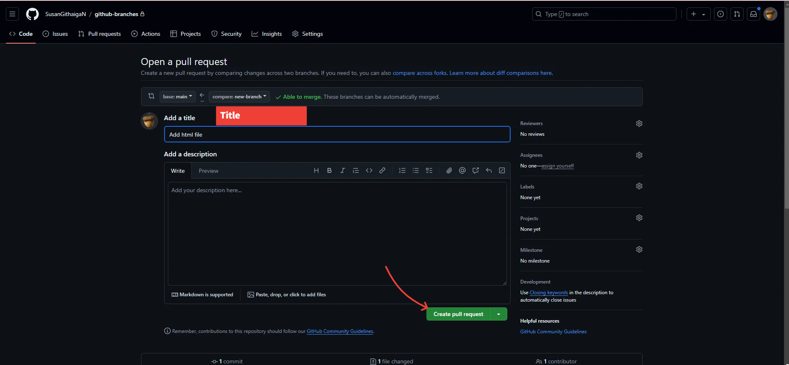

4. Wait for the repo to pass all checks

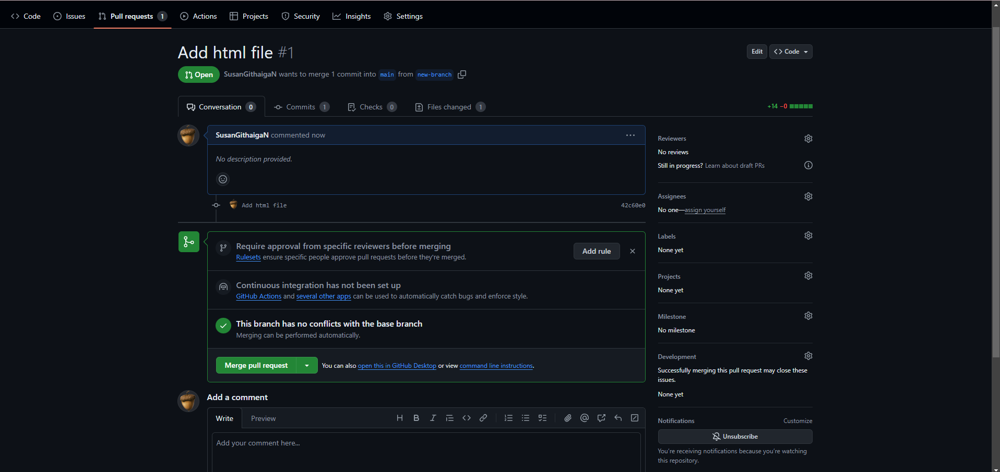

5. Confirm merge

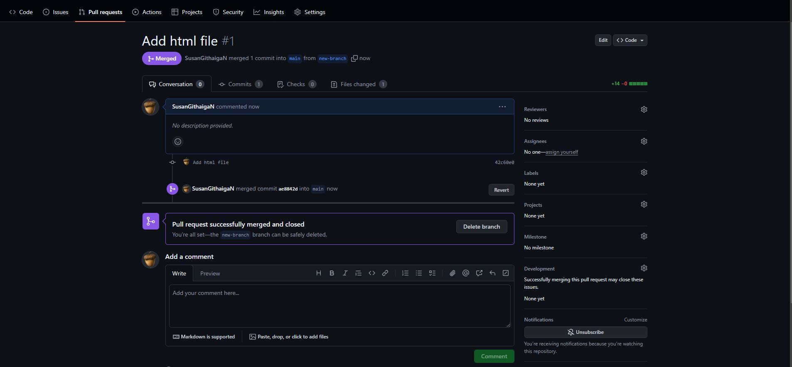


## Discuss the concept of "forking" a repository on GitHub. How does forking differ from cloning, and what are some scenarios where forking would be particularly useful?

 Forking creates a copy of the original repository on your account. This copy is entirely yours to experiment wit. Making changes(commits) on your forked repository does not affect the original repository unless you make a pull request. You also have to keep updating your forked repository in order to keep syncing(updating) your forked repository in order to keep it updates with the original repository.(see screenshot below):

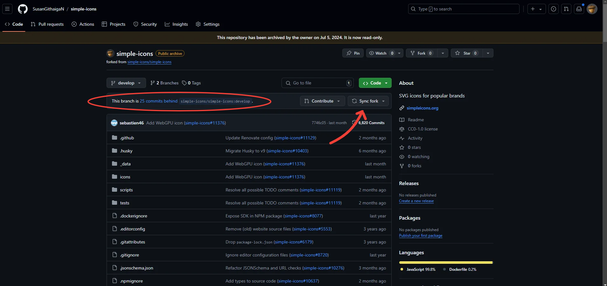


Forking is particularly useful when one is dealing with open source projects

Cloning is a process of copying a repository to your local machine. No copy of the repository is added to your github account. Cloning is a one-time process whereas forking is a continuous process.(see screenshot attached below)

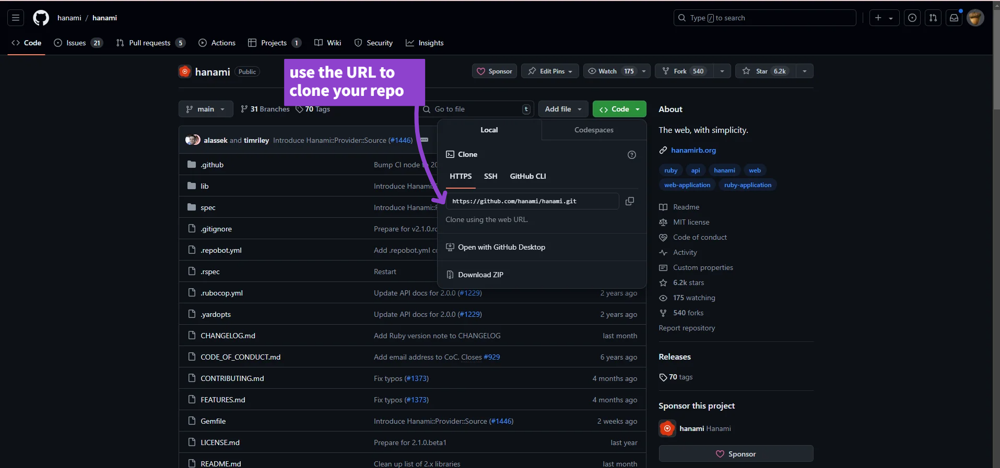


## Examine the importance of issues and project boards on GitHub. How can they be used to track bugs, manage tasks, and improve project organization? Provide examples of how these tools can enhance collaborative efforts.

Github issues are used to track work, give or receive feedback, collaborate on ideas or tasks, and efficiently communicate with team members on projects.(see screenshot attached below)

_Importance of GitHub issues_

**Bug Tracking:** Issues allow team members to report bugs or defects. Each issue can be labeled, assigned, and discussed, making it easier to prioritize and track the progress of bug fixes.

**Task Management:** Issues can be used to define and assign tasks, allowing for clear delineation of responsibilities. This helps in organizing work and ensuring all tasks are accounted for.

**Feature Requests:** Users and contributors can suggest new features or improvements through issues, which can be discussed and refined before implementation.


Github projects on the other hand are used when one wants to keep track of multiple issues and needs a way to combine these issues in one cohesive manner. 

_Importance of GitHub projects_
Project boards provide a visual overview of the project’s progress, showing tasks at different stages thus enhancing the collaborative learning process.

_Examples_

Reporting bugs on a project, suggesting implementation of new features

_Illustration_

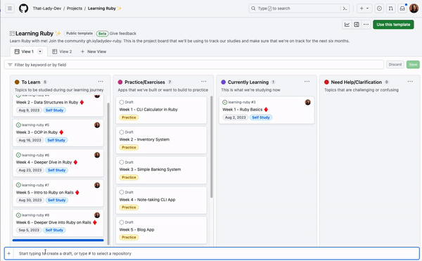


[Iluustration & content source for this question:](https://github.blog/developer-skills/github/10-things-you-didnt-know-you-could-do-with-github-projects/#:~:text=If%20you're%20an%20open,where%20GitHub%20Projects%20come%20in!)

[Read the article here:](https://github.blog/developer-skills/github/10-things-you-didnt-know-you-could-do-with-github-projects/#:~:text=If%20you're%20an%20open,where%20GitHub%20Projects%20come%20in!)


## Reflect on common challenges and best practices associated with using GitHub for version control. What are some common pitfalls new users might encounter, and what strategies can be employed to overcome them and ensure smooth collaboration?

_Merge conflicts_

When two people make changes to the same part of the codebase at the same time, conflicts arise. Resolving these conflicts requires understanding the changes and manually merging them.

_strategies to solve merge conflics_

**Clear communication:** Discuss and plan larger changes to avoid conflicts.

**Small, frequent commits:** Commit your changes often with clear commit messages to make resolving conflicts easier.

**Utilize branches:** Feature branches help isolate your changes and streamline the pull request process.

**Pull requests and code reviews:** Use pull requests to propose changes and get feedback before merging them into the main codebase.
